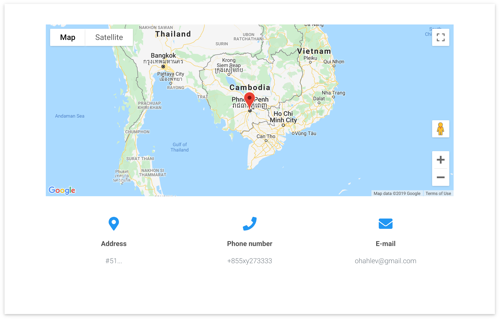
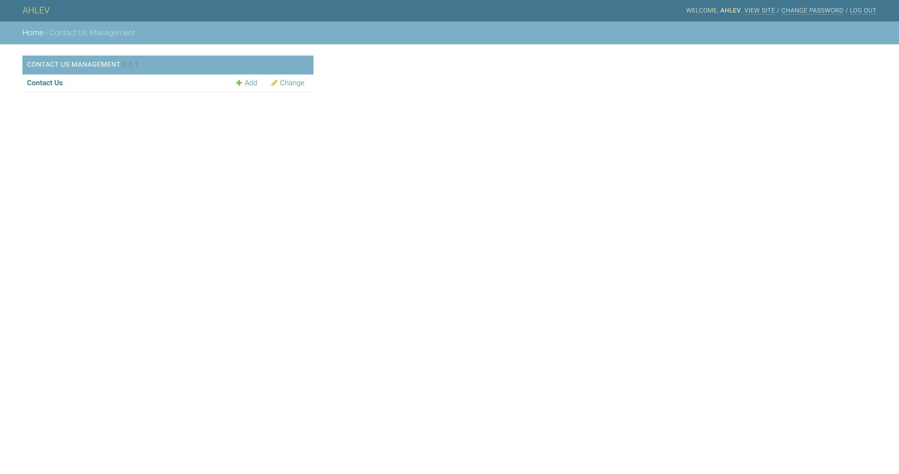
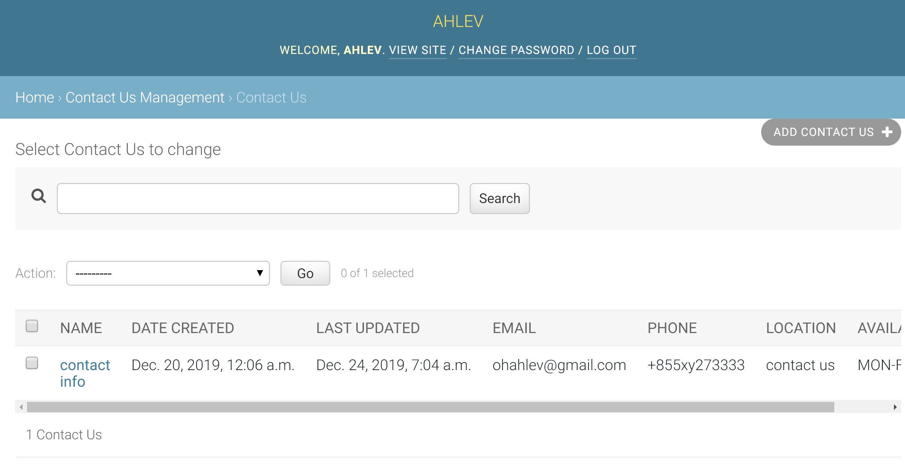
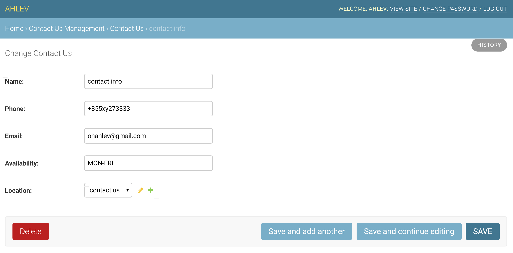

# DJANGO CONTACT US APPLICATION
The instructions below assume that you have a django project already set up; and a python virtual environment already installed and activated. 

## styles
All ahlev-django applications are using styles from [mdbootstrap.com](https://mdbootstrap.com), so please make sure you install 
ahlev-django-css-js first before proceeding to the next step.
Here is its repository.
[ahlev-django-css-js](https://github.com/ohahlev/ahlev-django-css-js.git)

## install from this repository
### clone
```
git clone https://github.com/ohahlev/ahlev-django-contact-us.git
```

### go to directory ahlev-django-contact-us
```
cd ahlev-django-contact-us
```

### create installer package
```
python3 setup.py sdist
```

### go to project directory
```
pip install dist/ahlev-django-contact-us-0.0.1.tar.gz
```

## install from pypi
### go to the project directory and install from pypi
```
pip install -i https://test.pypi.org/simple/ ahlev-django-contact-us 
```

## project configuration

### update settings.py as the following
```
INSTALLED_APPS = [
    'contact_us', # add this line
    ...
]
```

### add these lines to the end of settings.py if they don't exist yet
```
STATICFILES_DIRS = [
    os.path.join(BASE_DIR, "static")
]
#STATIC_ROOT = os.path.join(BASE_DIR, "static")
STATIC_URL = '/static/'
MEDIA_ROOT = os.path.join(BASE_DIR, 'uploads')
MEDIA_URL = '/medias/'
```

## screenshots
### frontend: contact us page

This is why django contact us applicaiton depends on [ahlev-django-location](https://github.com/ohahlev/ahlev-django-location.git)

### backend: contact us management


### backend: list contact us info


### backend: edit contact us info

The contact us model links to the location model of [ahlev-django-location](https://github.com/ohahlev/ahlev-django-location.git)